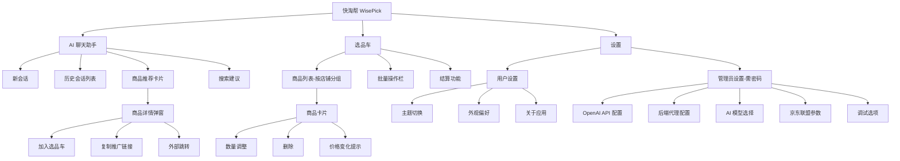
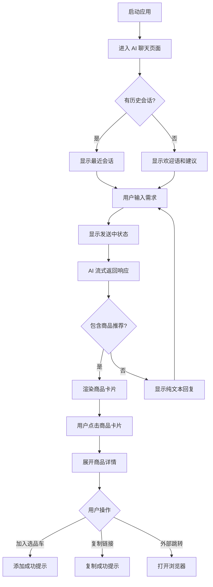
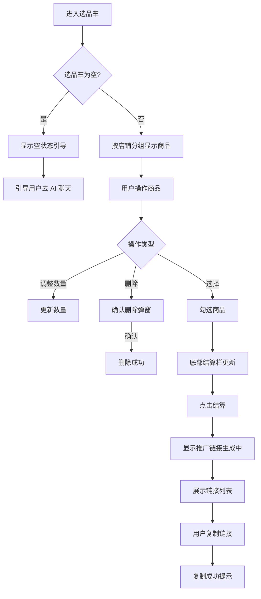
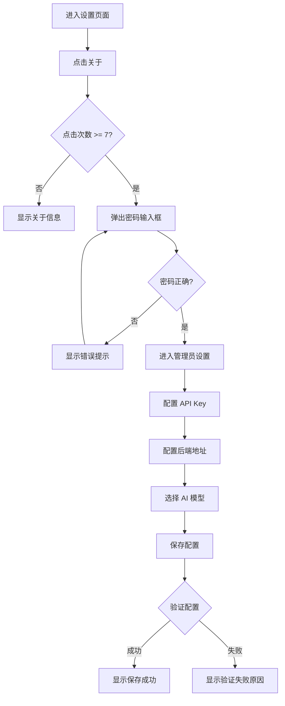

# 快淘帮 WisePick - UI/UX 设计规范文档

**版本**: 1.0  
**创建日期**: 2026-01-06  
**最后更新**: 2026-01-06  
**文档状态**: 正式版  
**设计师**: Sally (UX Expert Agent)

---

## 1. 文档概述

本文档定义了快淘帮 WisePick 的用户体验目标、信息架构、用户流程和视觉设计规范。它是视觉设计和前端开发的基础，确保一致性和以用户为中心的体验。

### 1.1 文档目的

- 为设计和开发团队提供统一的 UI/UX 标准
- 确保跨平台（Windows、macOS、Linux、Android、iOS、Web）一致的用户体验
- 指导 AI 辅助的 UI 组件生成
- 作为前端开发和设计评审的权威参考

### 1.2 变更记录

| 日期 | 版本 | 描述 | 作者 |
|------|------|------|------|
| 2026-01-06 | 1.0 | 初始 UI/UX 规范文档 | Sally (UX Expert) |

---

## 2. UX 目标与设计原则

### 2.1 目标用户画像

#### 2.1.1 购物达人 (Primary User)
- **特征**: 18-35 岁，经常网购，追求性价比
- **目标**: 快速找到心仪商品，比价省钱
- **痛点**: 平台切换繁琐，比价困难
- **技术水平**: 中等，熟悉移动应用

#### 2.1.2 联盟推广者 (Power User)
- **特征**: 25-45 岁，从事电商推广
- **目标**: 高效生成推广链接，追踪佣金
- **痛点**: 多平台管理复杂，链接生成耗时
- **技术水平**: 较高，需要高级功能

#### 2.1.3 价格敏感用户 (Casual User)
- **特征**: 所有年龄段，偶尔网购
- **目标**: 简单易用，快速上手
- **痛点**: 不愿学习复杂操作
- **技术水平**: 基础

#### 2.1.4 决策困难用户 (AI-Assisted User)
- **特征**: 需要购物建议的用户
- **目标**: 获得 AI 智能推荐
- **痛点**: 商品选择困难症
- **技术水平**: 各种水平

### 2.2 可用性目标

| 目标 | 指标 | 标准 |
|------|------|------|
| 易学性 | 新用户完成核心任务 | ≤ 5 分钟 |
| 效率 | 高级用户完成常用操作 | ≤ 3 次点击 |
| 容错性 | 关键操作的确认机制 | 100% 覆盖 |
| 满意度 | 用户满意度评分 | ≥ 4.2/5.0 |
| 可记忆性 | 间隔用户重新上手 | ≤ 2 分钟 |

### 2.3 核心设计原则

#### 原则 1：智能优先 (AI-First)
> AI 助手是核心入口，所有功能应围绕自然语言交互设计

- 聊天界面作为主要交互方式
- AI 推荐自然融入对话流
- 智能预测用户意图

#### 原则 2：清晰胜于花哨 (Clarity Over Cleverness)
> 优先清晰传达信息，而非追求视觉创新

- 商品信息一目了然
- 价格对比直观明了
- 操作反馈即时明确

#### 原则 3：渐进式披露 (Progressive Disclosure)
> 按需展示信息，减少认知负担

- 核心功能优先展示
- 高级设置按需隐藏
- 分步引导复杂操作

#### 原则 4：一致性模式 (Consistent Patterns)
> 整个应用使用统一的 UI 模式

- 统一的导航结构
- 一致的交互方式
- 标准化的组件行为

#### 原则 5：无障碍设计 (Accessible by Default)
> 从设计之初就考虑所有用户

- 符合 WCAG 2.1 AA 标准
- 支持屏幕阅读器
- 键盘完全可操作

---

## 3. 信息架构

### 3.1 站点地图 / 屏幕清单



### 3.2 导航结构

#### 3.2.1 主导航 (Primary Navigation)

**桌面端 (宽度 > 800px)**: NavigationRail（左侧垂直导航）
- 位置：屏幕左侧固定
- 宽度：72px（收起）/ 256px（展开）
- 包含：
  - 🤖 AI 助手（默认选中）
  - 🛒 选品车（带数量徽章）
  - ⚙️ 设置

**移动端 (宽度 ≤ 800px)**: BottomNavigationBar（底部导航）
- 位置：屏幕底部固定
- 高度：56px + 安全区域
- 包含相同导航项

#### 3.2.2 二级导航

**AI 聊天页面**:
- 左侧抽屉：会话历史列表
- 顶部操作栏：新建会话、清空对话

**选品车页面**:
- 顶部：全选/取消、批量操作
- 底部：结算栏

**设置页面**:
- 分组卡片式布局
- 管理员入口：点击"关于"7 次触发

#### 3.2.3 面包屑策略

本应用采用扁平化导航，不使用传统面包屑。通过以下方式提供导航上下文：
- 顶部标题栏显示当前页面名称
- 返回按钮（移动端）或侧边栏高亮（桌面端）
- 弹窗/抽屉使用遮罩 + 关闭按钮

---

## 4. 用户流程

### 4.1 核心流程：AI 对话购物推荐

**用户目标**: 通过自然语言描述需求，获得 AI 商品推荐

**入口**: 应用启动后默认进入聊天页面

**成功标准**: 用户能查看推荐商品并进行后续操作



**边缘情况与错误处理**:
- **网络超时**: 显示"网络连接超时，请稍后重试"，提供重试按钮
- **API 限流 (429)**: 显示"请求过多，请稍后重试"
- **AI 服务错误**: 显示友好错误提示，建议检查 API 配置
- **空搜索结果**: 显示"未找到相关商品，请换个关键词试试"

### 4.2 核心流程：选品车管理

**用户目标**: 管理已收藏的商品，批量生成推广链接

**入口**: 底部导航/侧边栏 → 选品车

**成功标准**: 用户能成功管理商品并复制推广链接



**边缘情况与错误处理**:
- **价格变化**: 商品卡片显示价格变化标签（降价/涨价）
- **商品下架**: 显示"商品已下架"状态，建议删除
- **链接生成失败**: 显示错误原因，提供单独重试
- **批量操作超时**: 显示进度，支持取消

### 4.3 核心流程：管理员设置

**用户目标**: 配置 API Key 和应用参数

**入口**: 设置 → 关于（点击 7 次）→ 输入密码

**成功标准**: 成功保存配置并验证可用



---

## 5. 页面布局设计

### 5.1 聊天页面 (ChatPage) - 核心页面

**设计文件**: `screens/chat_page.dart`

**目的**: 提供与 AI 助手的自然语言交互界面

**布局结构**:

```
┌─────────────────────────────────────────────────────────┐
│  ← [会话标题]                          [新建] [清空]    │ ← 顶部标题栏 (56dp)
├─────────────────────────────────────────────────────────┤
│                                                         │
│  ┌─────────────────────────────────────────────────┐   │
│  │  [AI 头像]  欢迎使用快淘帮！                      │   │ ← AI 消息气泡
│  │            我是您的智能购物助手...                │   │
│  └─────────────────────────────────────────────────┘   │
│                                                         │
│                    ┌───────────────────────────────┐   │
│                    │  推荐一款 800 元的 USB DAC    │   │ ← 用户消息气泡
│                    └───────────────────────────────┘   │
│                                                         │
│  ┌─────────────────────────────────────────────────┐   │
│  │  [AI 头像]  为您推荐以下商品：                   │   │ ← AI 回复
│  │                                                  │   │
│  │  ┌─────────┐ ┌─────────┐ ┌─────────┐           │   │
│  │  │ 商品1   │ │ 商品2   │ │ 商品3   │           │   │ ← 商品卡片组
│  │  │ ¥799   │ │ ¥850   │ │ ¥780   │           │   │
│  │  └─────────┘ └─────────┘ └─────────┘           │   │
│  └─────────────────────────────────────────────────┘   │
│                                                         │
│  ┌─────────────────────────────────────────────────┐   │ ← 快捷建议区
│  │  💡 "推荐耳机"  "比较价格"  "查看优惠"           │   │
│  └─────────────────────────────────────────────────┘   │
│                                                         │
├─────────────────────────────────────────────────────────┤
│  ┌────────────────────────────────────────┐ [发送📤] │ ← 输入区域 (56dp)
│  │  输入您的需求...                        │           │
│  └────────────────────────────────────────┘           │
└─────────────────────────────────────────────────────────┘
```

**关键元素**:
1. **顶部标题栏**: 显示当前会话标题，新建/清空操作按钮
2. **消息列表**: 可滚动的对话流，支持流式显示 AI 回复
3. **商品卡片**: 嵌入对话中的可交互商品推荐卡片
4. **快捷建议**: 常用提示词快捷入口
5. **输入框**: 多行文本输入，支持回车发送

**交互说明**:
- 消息列表自动滚动到底部
- AI 回复支持流式渲染（打字机效果）
- 商品卡片点击展开详情底部弹窗
- 长按消息可复制内容
- 左滑/右滑切换历史会话（移动端）

### 5.2 选品车页面 (CartPage)

**设计文件**: `screens/cart_page.dart`

**目的**: 管理收藏商品，批量生成推广链接

**布局结构**:

```
┌─────────────────────────────────────────────────────────┐
│  选品车 (3件)                       [全选] [删除]       │ ← 顶部操作栏
├─────────────────────────────────────────────────────────┤
│                                                         │
│  ── 京东自营官方旗舰店 ──────────────────────          │ ← 店铺分组标题
│                                                         │
│  ┌─────────────────────────────────────────────────┐   │
│  │ [☑] [商品图] 商品标题...                        │   │
│  │              ¥799  原价¥999  优惠¥200          │   │
│  │              [-] 1 [+]                  [删除]  │   │
│  │              ↓ 降价 ¥50                         │   │ ← 价格变化提示
│  └─────────────────────────────────────────────────┘   │
│                                                         │
│  ┌─────────────────────────────────────────────────┐   │
│  │ [☐] [商品图] 另一个商品...                      │   │
│  │              ¥599                               │   │
│  │              [-] 2 [+]                  [删除]  │   │
│  └─────────────────────────────────────────────────┘   │
│                                                         │
│  ── 淘宝天猫店铺 ──────────────────────                │
│                                                         │
│  ┌─────────────────────────────────────────────────┐   │
│  │ [☑] [商品图] 淘宝商品...                        │   │
│  │              ¥450                               │   │
│  │              [-] 1 [+]                  [删除]  │   │
│  └─────────────────────────────────────────────────┘   │
│                                                         │
├─────────────────────────────────────────────────────────┤
│  已选 2 件  合计: ¥1249                    [结算]      │ ← 底部结算栏
└─────────────────────────────────────────────────────────┘
```

**关键元素**:
1. **顶部操作栏**: 商品数量、全选、批量删除
2. **店铺分组**: 按店铺分组展示商品
3. **商品卡片**: 选择框、图片、信息、数量、操作
4. **价格变化标签**: 降价（绿色）/涨价（红色）提示
5. **底部结算栏**: 选中数量、合计金额、结算按钮

**交互说明**:
- 左滑商品卡片显示删除操作（移动端）
- 点击卡片查看商品详情
- 结算弹窗显示推广链接列表
- 价格自动刷新（后台服务）
- 价格变化时显示本地通知

### 5.3 商品详情弹窗 (ProductDetailSheet)

**设计文件**: `widgets/product_detail_sheet.dart`

**目的**: 展示商品详细信息，提供操作入口

**布局结构**:

```
┌─────────────────────────────────────────────────────────┐
│  ─────────── (拖拽指示器)                               │
├─────────────────────────────────────────────────────────┤
│                                                         │
│  ┌─────────────────────────────────────────────────┐   │
│  │                                                  │   │
│  │              [商品大图]                          │   │ ← 商品图片 (16:9)
│  │                                                  │   │
│  └─────────────────────────────────────────────────┘   │
│                                                         │
│  商品标题商品标题商品标题商品标题...                    │ ← 标题 (2行)
│                                                         │
│  ┌──────────┐  ┌──────────┐  ┌──────────┐             │
│  │  京东    │  │  ★ 4.9   │  │ 销量 1万+ │             │ ← 标签组
│  └──────────┘  └──────────┘  └──────────┘             │
│                                                         │
│  ¥799                                                  │ ← 现价 (大字)
│  ¥999 原价  ¥200 优惠券  预估佣金 ¥39.95              │ ← 价格详情
│                                                         │
│  店铺: 京东自营官方旗舰店                              │ ← 店铺信息
│                                                         │
├─────────────────────────────────────────────────────────┤
│  ┌─────────────┐ ┌─────────────┐ ┌─────────────┐      │
│  │ 🛒 加入选品车 │ │ 🔗 复制链接   │ │ 🔗 外部打开  │      │ ← 操作按钮
│  └─────────────┘ └─────────────┘ └─────────────┘      │
└─────────────────────────────────────────────────────────┘
```

### 5.4 设置页面 (SettingsPage)

**布局结构**:

```
┌─────────────────────────────────────────────────────────┐
│  设置                                                   │ ← 标题栏
├─────────────────────────────────────────────────────────┤
│                                                         │
│  ┌─────────────────────────────────────────────────┐   │
│  │  外观设置                                        │   │ ← 分组卡片
│  │  ─────────────────────────────────────────────  │   │
│  │  深色模式                              [开关]   │   │
│  │  ─────────────────────────────────────────────  │   │
│  │  主题色                               [选择器]  │   │
│  └─────────────────────────────────────────────────┘   │
│                                                         │
│  ┌─────────────────────────────────────────────────┐   │
│  │  通知设置                                        │   │ ← 分组卡片
│  │  ─────────────────────────────────────────────  │   │
│  │  价格变化通知                          [开关]   │   │
│  └─────────────────────────────────────────────────┘   │
│                                                         │
│  ┌─────────────────────────────────────────────────┐   │
│  │  关于                                            │   │ ← 可点击7次
│  │  ─────────────────────────────────────────────  │   │
│  │  版本 1.0.0                                     │   │
│  │  ─────────────────────────────────────────────  │   │
│  │  开源许可                                   >   │   │
│  └─────────────────────────────────────────────────┘   │
│                                                         │
└─────────────────────────────────────────────────────────┘
```

---

## 6. 组件库 / 设计系统

### 6.1 设计系统方案

**采用方案**: Material Design 3 + 自定义扩展

**实现策略**:
- 基础组件使用 Flutter Material 3 组件
- 业务组件基于 Material 组件扩展
- 遵循 Material Design 3 设计规范
- 支持动态颜色 (Dynamic Color)

### 6.2 核心组件

#### 6.2.1 ProductCard (商品卡片)

**目的**: 统一的商品信息展示

**变体**:
- `ProductCard.compact`: 紧凑模式（列表视图）
- `ProductCard.expanded`: 展开模式（详情弹窗）
- `ProductCard.chat`: 聊天嵌入模式

**状态**:
- `default`: 默认状态
- `selected`: 选中状态（带勾选）
- `loading`: 加载中（骨架屏）
- `disabled`: 已下架/不可用

**使用指南**:
- 图片使用 `ClipRRect` 圆角 12dp
- 价格使用主题色强调
- 平台标识使用对应品牌色
- 价格变化使用语义化颜色

#### 6.2.2 MessageBubble (消息气泡)

**目的**: 聊天消息的统一展示

**变体**:
- `MessageBubble.user`: 用户消息（右对齐，主题色背景）
- `MessageBubble.assistant`: AI 消息（左对齐，表面色背景）
- `MessageBubble.system`: 系统消息（居中，灰色文字）

**状态**:
- `default`: 默认状态
- `streaming`: 流式加载中（带闪烁光标）
- `error`: 发送失败（带重试按钮）

#### 6.2.3 PlatformBadge (平台标识)

**目的**: 标识商品来源平台

**变体**:
- `taobao`: 淘宝橙 (#FF5722)
- `jd`: 京东红 (#E53935)
- `pdd`: 拼多多红 (#FF4E4E)

**样式**:
- 圆角 4dp
- 内边距 4dp x 8dp
- 字体 12sp 白色

#### 6.2.4 LoadingIndicator (加载指示器)

**目的**: 统一的加载状态展示

**变体**:
- `circular`: 圆形进度（默认）
- `linear`: 线性进度
- `skeleton`: 骨架屏
- `shimmer`: 闪烁效果

#### 6.2.5 EmptyState (空状态)

**目的**: 统一的空状态展示

**元素**:
- 插图（可选）
- 标题文字
- 描述文字
- 操作按钮（可选）

---

## 7. 品牌与视觉指南

### 7.1 视觉标识

**应用名称**: 快淘帮 WisePick

**品牌理念**: 智能、高效、可信赖

**设计风格**: 现代简约、智能科技感

### 7.2 颜色方案

#### 7.2.1 主题色板 - 浅色模式

| 颜色类型 | Hex 色值 | 用途 |
|----------|----------|------|
| Primary | `#6750A4` | 主要按钮、强调元素、选中状态 |
| On Primary | `#FFFFFF` | 主色上的文字/图标 |
| Primary Container | `#EADDFF` | 主色容器背景 |
| Secondary | `#625B71` | 次要按钮、标签 |
| Tertiary | `#7D5260` | 第三级强调 |
| Surface | `#FFFBFE` | 卡片、对话框背景 |
| Surface Variant | `#E7E0EC` | 分隔线、边框 |
| Background | `#FFFBFE` | 页面背景 |
| Error | `#B3261E` | 错误状态、删除操作 |
| Success | `#2E7D32` | 成功状态、降价提示 |
| Warning | `#F57C00` | 警告状态、涨价提示 |

#### 7.2.2 主题色板 - 深色模式

| 颜色类型 | Hex 色值 | 用途 |
|----------|----------|------|
| Primary | `#D0BCFF` | 主要按钮、强调元素 |
| On Primary | `#381E72` | 主色上的文字/图标 |
| Primary Container | `#4F378B` | 主色容器背景 |
| Secondary | `#CCC2DC` | 次要按钮、标签 |
| Surface | `#1C1B1F` | 卡片、对话框背景 |
| Surface Variant | `#49454F` | 分隔线、边框 |
| Background | `#1C1B1F` | 页面背景 |
| Error | `#F2B8B5` | 错误状态 |
| Success | `#81C784` | 成功状态 |

#### 7.2.3 平台品牌色

| 平台 | Hex 色值 | 用途 |
|------|----------|------|
| 淘宝 | `#FF5722` | 淘宝商品标识 |
| 天猫 | `#FF0036` | 天猫商品标识 |
| 京东 | `#E53935` | 京东商品标识 |
| 拼多多 | `#FF4E4E` | 拼多多商品标识 |

### 7.3 字体排版

#### 7.3.1 字体家族

| 用途 | 字体 | 备选 |
|------|------|------|
| 主要字体 | Noto Sans SC | Roboto, system-ui |
| 数字/价格 | DIN Alternate | Roboto Mono |
| 代码 | JetBrains Mono | Consolas |

#### 7.3.2 字体大小规范

| 元素 | 大小 | 字重 | 行高 | 用途 |
|------|------|------|------|------|
| Display Large | 57sp | 400 | 64sp | 大标题（启动屏） |
| Display Medium | 45sp | 400 | 52sp | 中标题 |
| Headline Large | 32sp | 400 | 40sp | 页面标题 |
| Headline Medium | 28sp | 400 | 36sp | 分区标题 |
| Title Large | 22sp | 500 | 28sp | 卡片标题 |
| Title Medium | 16sp | 500 | 24sp | 列表标题 |
| Body Large | 16sp | 400 | 24sp | 正文 |
| Body Medium | 14sp | 400 | 20sp | 辅助文字 |
| Body Small | 12sp | 400 | 16sp | 注释、时间戳 |
| Label Large | 14sp | 500 | 20sp | 按钮文字 |
| Label Medium | 12sp | 500 | 16sp | 标签、徽章 |

#### 7.3.3 价格显示规范

```
现价:     ¥799      Title Large, Primary Color, Bold
原价:     ¥999      Body Medium, On Surface Variant, 删除线
优惠券:   -¥200     Body Medium, Error Color
最终价:   ¥599      Headline Medium, Primary Color, Bold
```

### 7.4 图标系统

**图标库**: Material Symbols Rounded

**图标大小规范**:
| 用途 | 大小 | 样式 |
|------|------|------|
| 导航图标 | 24dp | Rounded, 填充 |
| 操作图标 | 20dp | Rounded, 描边 |
| 指示图标 | 16dp | Rounded |
| 按钮图标 | 18dp | Rounded |

**自定义图标**:
- 平台 Logo（淘宝、京东、拼多多）
- 应用 Logo

### 7.5 间距与布局

#### 7.5.1 网格系统

**基础单位**: 4dp (0.25rem)

**常用间距**:
| 名称 | 值 | 用途 |
|------|------|------|
| xs | 4dp | 图标与文字间距 |
| sm | 8dp | 紧凑元素间距 |
| md | 12dp | 默认元素间距 |
| lg | 16dp | 卡片内边距 |
| xl | 24dp | 分区间距 |
| xxl | 32dp | 页面边距 |

#### 7.5.2 圆角规范

| 元素 | 圆角 |
|------|------|
| 按钮 | 20dp (full) |
| 卡片 | 12dp |
| 输入框 | 8dp |
| 图片 | 8dp |
| 对话气泡 | 16dp |
| 芯片/标签 | 8dp |
| 底部弹窗 | 28dp (顶部) |

---

## 8. 无障碍设计要求

### 8.1 合规标准

**目标**: WCAG 2.1 AA 级合规

### 8.2 具体要求

#### 8.2.1 视觉无障碍

**颜色对比度**:
- 普通文本：≥ 4.5:1
- 大文本 (≥18sp)：≥ 3:1
- UI 组件和图形：≥ 3:1

**焦点指示器**:
- 可见的焦点轮廓（2dp 描边）
- 焦点颜色与背景对比度 ≥ 3:1

**文字缩放**:
- 支持系统字体大小设置
- 支持 200% 放大不截断

#### 8.2.2 交互无障碍

**键盘导航**:
- 所有交互元素可通过 Tab 访问
- 支持 Enter/Space 激活按钮
- 支持 Escape 关闭弹窗
- 逻辑的焦点顺序

**屏幕阅读器**:
- 所有图片提供 alt 文本
- 表单元素有关联标签
- 状态变化有语音播报
- 使用 Semantics Widget

**触摸目标**:
- 最小触摸区域：48 x 48 dp
- 触摸目标间距：≥ 8dp

#### 8.2.3 内容无障碍

**替代文本**:
- 商品图片：商品名称 + 价格
- 平台图标：平台名称
- 装饰图片：空 alt 或隐藏

**标题结构**:
- 页面只有一个 H1
- 标题层级不跳级
- 标题描述后续内容

**表单标签**:
- 每个输入框有可见标签
- 错误提示与输入框关联
- 使用 placeholder 补充说明

### 8.3 测试策略

| 测试类型 | 工具 | 频率 |
|----------|------|------|
| 自动化测试 | Flutter Accessibility | 每次构建 |
| 色彩对比检查 | Contrast Checker | 设计评审 |
| 屏幕阅读器测试 | TalkBack/VoiceOver | 每个版本 |
| 键盘导航测试 | 手动测试 | 每个版本 |

---

## 9. 响应式设计策略

### 9.1 断点定义

| 断点名称 | 最小宽度 | 最大宽度 | 目标设备 |
|----------|----------|----------|----------|
| compact | 0 | 599dp | 手机竖屏 |
| medium | 600dp | 839dp | 平板竖屏、手机横屏 |
| expanded | 840dp | 1199dp | 平板横屏、小桌面 |
| large | 1200dp | - | 大桌面屏幕 |

### 9.2 适配策略

#### 9.2.1 布局变化

**compact (手机)**:
- 底部导航栏
- 单列布局
- 全屏弹窗
- 抽屉式会话列表

**medium (平板竖屏)**:
- 底部导航栏（可选侧边栏）
- 双列商品网格
- 底部弹窗
- 侧边抽屉会话列表

**expanded (桌面)**:
- 侧边导航栏 (NavigationRail)
- 三列布局（导航 + 内容 + 详情）
- 侧边弹窗
- 常驻会话列表

**large (大桌面)**:
- 展开的侧边导航栏
- 多列布局
- 最大内容宽度限制 (1400dp)

#### 9.2.2 导航变化

| 断点 | 主导航 | 二级导航 |
|------|--------|----------|
| compact | BottomNavigationBar | 顶部标题 + 返回 |
| medium | BottomNavigationBar | 顶部标题 + 返回 |
| expanded | NavigationRail (收起) | 侧边抽屉 |
| large | NavigationRail (展开) | 常驻侧边栏 |

#### 9.2.3 内容优先级

**移动端优先内容**:
1. 聊天输入框（始终可见）
2. 最新消息
3. 商品核心信息（价格、图片）
4. 主要操作按钮

**桌面端增强内容**:
- 商品详细信息展开显示
- 多列商品对比
- 高级筛选选项
- 键盘快捷键提示

#### 9.2.4 交互变化

| 交互 | 移动端 | 桌面端 |
|------|--------|--------|
| 商品选择 | 长按 → 菜单 | 右键菜单 |
| 删除 | 左滑 | 悬浮显示删除按钮 |
| 刷新 | 下拉刷新 | 刷新按钮 |
| 发送消息 | 点击发送按钮 | Enter 发送，Shift+Enter 换行 |

---

## 10. 动效与微交互

### 10.1 动效原则

1. **目的性**: 每个动画都应有明确目的（引导注意、反馈、过渡）
2. **自然流畅**: 遵循物理规律，使用 ease-out 曲线
3. **快速响应**: 动画时长适中，不阻碍操作
4. **可关闭**: 尊重系统"减少动画"设置

### 10.2 核心动画

#### 10.2.1 页面过渡

**动画名称**: Page Transition
**描述**: 页面切换时的滑动和渐变效果
**时长**: 300ms
**缓动**: Easing.standardDecelerate

```dart
// Flutter 实现
PageRouteBuilder(
  transitionDuration: Duration(milliseconds: 300),
  transitionsBuilder: (context, animation, secondaryAnimation, child) {
    return FadeTransition(
      opacity: animation,
      child: SlideTransition(
        position: Tween<Offset>(
          begin: Offset(0.05, 0),
          end: Offset.zero,
        ).animate(CurvedAnimation(
          parent: animation,
          curve: Curves.easeOutCubic,
        )),
        child: child,
      ),
    );
  },
);
```

#### 10.2.2 流式文字显示

**动画名称**: Streaming Text
**描述**: AI 回复的流式显示效果（打字机效果）
**时长**: 每字符 20-50ms
**缓动**: 线性

#### 10.2.3 商品卡片展开

**动画名称**: Card Expansion
**描述**: 商品卡片点击后展开为详情弹窗
**时长**: 350ms
**缓动**: Easing.emphasizedDecelerate

#### 10.2.4 加入选品车

**动画名称**: Add to Cart
**描述**: 商品飞入选品车图标的动画
**时长**: 500ms
**缓动**: Easing.emphasizedAccelerate → Easing.emphasizedDecelerate

#### 10.2.5 价格变化

**动画名称**: Price Change
**描述**: 价格更新时的数字滚动 + 颜色闪烁
**时长**: 600ms
**缓动**: Easing.standard

#### 10.2.6 加载状态

**动画名称**: Shimmer Loading
**描述**: 骨架屏闪烁效果
**时长**: 1500ms (循环)
**缓动**: 线性

#### 10.2.7 按钮反馈

**动画名称**: Button Press
**描述**: 按钮点击时的缩放反馈
**时长**: 100ms 按下，200ms 恢复
**缓动**: Easing.standard

### 10.3 减少动画模式

当系统开启"减少动画"时：
- 页面过渡改为即时切换
- 流式文字改为整段显示
- 取消所有装饰性动画
- 保留必要的状态指示动画

---

## 11. 性能设计考量

### 11.1 性能目标

| 指标 | 目标值 | 测量方法 |
|------|--------|----------|
| 首次内容渲染 (FCP) | < 1.5s | DevTools |
| 可交互时间 (TTI) | < 3s | DevTools |
| 交互响应延迟 | < 100ms | 用户感知 |
| 列表滚动帧率 | ≥ 60 FPS | DevTools |
| 动画帧率 | ≥ 60 FPS | DevTools |

### 11.2 设计策略

#### 11.2.1 图片优化

- 使用 WebP 格式
- 提供多分辨率版本 (1x, 2x, 3x)
- 实现懒加载和占位符
- 商品图片使用缩略图

#### 11.2.2 列表优化

- 使用 `ListView.builder` 虚拟滚动
- 限制可见项目数量
- 分页加载（每页 10-20 项）
- 骨架屏预占位

#### 11.2.3 动画优化

- 使用 `AnimatedBuilder` 减少重绘
- 避免在滚动时播放复杂动画
- 使用 `RepaintBoundary` 隔离重绘区域
- 减少动画同时播放数量

#### 11.2.4 状态管理优化

- 使用 Riverpod 的选择性更新
- 避免不必要的 UI 重建
- 缓存计算结果
- 懒加载非关键数据

---

## 12. 下一步行动

### 12.1 即时行动

1. **设计评审**: 与产品和开发团队评审本规范
2. **原型制作**: 在 Figma 中创建高保真原型
3. **组件开发**: 根据规范开发基础组件库
4. **无障碍验证**: 进行初步无障碍测试

### 12.2 设计交付清单

- [x] 用户流程文档化
- [x] 组件清单完成
- [x] 无障碍要求定义
- [x] 响应式策略明确
- [x] 品牌指南整合
- [x] 性能目标建立
- [ ] 高保真设计稿完成
- [ ] 设计开发交付会议
- [ ] 组件库代码实现

---

## 13. 附录

### 13.1 参考文档

- [PRD 文档](../PRD.md) - 产品需求文档
- [前端架构文档](./frontend-architecture.md) - 前端架构设计
- [总体架构文档](./architecture.md) - 系统架构设计
- [Material Design 3](https://m3.material.io/) - 设计系统指南
- [Flutter 官方文档](https://docs.flutter.dev/) - 开发指南

### 13.2 设计工具

- **原型工具**: Figma
- **图标资源**: Material Symbols
- **颜色工具**: Material Theme Builder
- **无障碍检查**: Stark, Contrast Checker

### 13.3 变更记录

| 版本 | 日期 | 变更内容 | 作者 |
|------|------|----------|------|
| 1.0 | 2026-01-06 | 初始 UI/UX 规范文档 | Sally (UX Expert) |

---

**文档维护者**: UX 设计团队  
**审核者**: 产品团队、开发团队  
**批准者**: 产品负责人

---

*本文档基于快淘帮 WisePick 项目的 PRD 和架构文档编写，为前端开发提供完整的 UI/UX 设计指导。*


