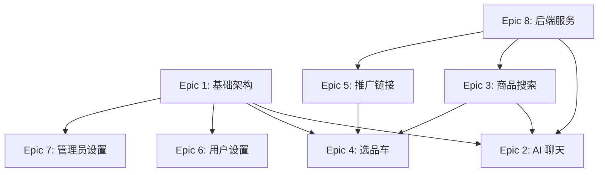

# 快淘帮 WisePick - Epic 与 Story 总览

**版本**: 1.0  
**创建日期**: 2026-01-06  
**文档状态**: 正式版  
**作者**: Sarah (Product Owner Agent)

---

## 文档说明

本文档是快淘帮 WisePick 项目的 Epic 和 Story 总览，基于 PRD、前端架构、后端架构和 UI/UX 规范文档整理。所有 Story 遵循敏捷开发最佳实践，按优先级排序，可直接用于 Sprint 规划。

---

## Epic 列表

| Epic # | Epic 名称 | Story 数量 | 优先级 | 状态 |
|--------|-----------|------------|--------|------|
| E1 | 应用基础架构 | 4 | P0 | Draft |
| E2 | AI 聊天助手 | 6 | P0 | Draft |
| E3 | 商品搜索与展示 | 4 | P0 | Draft |
| E4 | 选品车管理 | 5 | P0 | Draft |
| E5 | 推广链接生成 | 3 | P1 | Draft |
| E6 | 用户设置 | 2 | P1 | Draft |
| E7 | 管理员设置 | 3 | P1 | Draft |
| E8 | 后端代理服务 | 5 | P0 | Draft |

---

## Epic 1: 应用基础架构

### 描述
建立应用的基础框架，包括主题系统、响应式导航、本地存储初始化等核心功能。

### Stories

| Story # | Story 名称 | 优先级 | 估点 |
|---------|-----------|--------|------|
| 1.1 | 应用入口与初始化 | P0 | 3 |
| 1.2 | Material Design 3 主题系统 | P0 | 5 |
| 1.3 | 响应式导航框架 | P0 | 5 |
| 1.4 | Hive 本地存储配置 | P0 | 3 |

---

## Epic 2: AI 聊天助手

### 描述
实现 AI 聊天助手核心功能，包括自然语言对话、流式响应、商品推荐展示和会话管理。

### Stories

| Story # | Story 名称 | 优先级 | 估点 |
|---------|-----------|--------|------|
| 2.1 | 聊天页面基础布局 | P0 | 5 |
| 2.2 | 消息气泡组件 | P0 | 3 |
| 2.3 | 流式文字动画 | P0 | 5 |
| 2.4 | AI 对话服务集成 | P0 | 8 |
| 2.5 | 会话管理功能 | P1 | 5 |
| 2.6 | 快捷建议与输入增强 | P1 | 3 |

---

## Epic 3: 商品搜索与展示

### 描述
实现多平台商品搜索、统一商品模型、商品卡片组件和详情展示功能。

### Stories

| Story # | Story 名称 | 优先级 | 估点 |
|---------|-----------|--------|------|
| 3.1 | 商品数据模型与适配器 | P0 | 5 |
| 3.2 | 商品卡片组件 | P0 | 5 |
| 3.3 | 商品详情底部弹窗 | P0 | 5 |
| 3.4 | 多平台搜索服务 | P0 | 8 |

---

## Epic 4: 选品车管理

### 描述
实现选品车功能，包括商品添加/删除、数量管理、价格监控和结算功能。

### Stories

| Story # | Story 名称 | 优先级 | 估点 |
|---------|-----------|--------|------|
| 4.1 | 选品车页面布局 | P0 | 5 |
| 4.2 | 选品车数据服务 | P0 | 5 |
| 4.3 | 商品数量与批量操作 | P0 | 3 |
| 4.4 | 价格监控与通知 | P1 | 8 |
| 4.5 | 结算功能 | P1 | 5 |

---

## Epic 5: 推广链接生成

### 描述
实现推广链接生成功能，支持淘宝、京东、拼多多三大平台的转链和缓存。

### Stories

| Story # | Story 名称 | 优先级 | 估点 |
|---------|-----------|--------|------|
| 5.1 | 推广链接生成服务 | P1 | 8 |
| 5.2 | 链接缓存机制 | P1 | 3 |
| 5.3 | 链接复制与分享 | P1 | 2 |

---

## Epic 6: 用户设置

### 描述
实现用户可访问的设置功能，包括主题切换和通知偏好。

### Stories

| Story # | Story 名称 | 优先级 | 估点 |
|---------|-----------|--------|------|
| 6.1 | 用户设置页面 | P1 | 3 |
| 6.2 | 主题切换功能 | P1 | 2 |

---

## Epic 7: 管理员设置

### 描述
实现管理员设置功能，包括 API 配置、模型选择和调试选项。

### Stories

| Story # | Story 名称 | 优先级 | 估点 |
|---------|-----------|--------|------|
| 7.1 | 管理员入口与验证 | P1 | 3 |
| 7.2 | API 配置页面 | P1 | 5 |
| 7.3 | 调试选项与 Mock 模式 | P2 | 3 |

---

## Epic 8: 后端代理服务

### 描述
实现后端代理服务器，包括 AI API 代理、签名服务和转链服务。

### Stories

| Story # | Story 名称 | 优先级 | 估点 |
|---------|-----------|--------|------|
| 8.1 | 代理服务器基础框架 | P0 | 5 |
| 8.2 | OpenAI API 代理 | P0 | 5 |
| 8.3 | 淘宝联盟签名与转链 | P0 | 5 |
| 8.4 | 京东联盟签名与转链 | P0 | 5 |
| 8.5 | 拼多多签名与转链 | P0 | 5 |

---

## 依赖关系

---

## Sprint 建议

### Sprint 1 (基础搭建)
- E1.1 应用入口与初始化
- E1.2 Material Design 3 主题系统
- E1.4 Hive 本地存储配置
- E8.1 代理服务器基础框架

### Sprint 2 (核心功能)
- E1.3 响应式导航框架
- E2.1 聊天页面基础布局
- E2.2 消息气泡组件
- E8.2 OpenAI API 代理

### Sprint 3 (AI 聊天完善)
- E2.3 流式文字动画
- E2.4 AI 对话服务集成
- E3.1 商品数据模型与适配器
- E3.2 商品卡片组件

### Sprint 4 (商品与搜索)
- E3.3 商品详情底部弹窗
- E3.4 多平台搜索服务
- E8.3 淘宝联盟签名与转链
- E8.4 京东联盟签名与转链

### Sprint 5 (选品车)
- E4.1 选品车页面布局
- E4.2 选品车数据服务
- E4.3 商品数量与批量操作
- E8.5 拼多多签名与转链

### Sprint 6 (推广与设置)
- E5.1 推广链接生成服务
- E5.2 链接缓存机制
- E5.3 链接复制与分享
- E6.1 用户设置页面

### Sprint 7 (完善与优化)
- E2.5 会话管理功能
- E2.6 快捷建议与输入增强
- E4.4 价格监控与通知
- E4.5 结算功能

### Sprint 8 (管理员功能)
- E6.2 主题切换功能
- E7.1 管理员入口与验证
- E7.2 API 配置页面
- E7.3 调试选项与 Mock 模式

---

## 参考文档

- [PRD 文档](../../PRD.md)
- [前端架构文档](../frontend-architecture.md)
- [后端架构文档](../backend-architecture.md)
- [UI/UX 规范文档](../front-end-spec.md)
- [AI UI 提示词文档](../ai-ui-prompts.md)

---

**文档维护者**: 产品团队  
**审核者**: 技术团队  
**批准者**: 产品负责人

